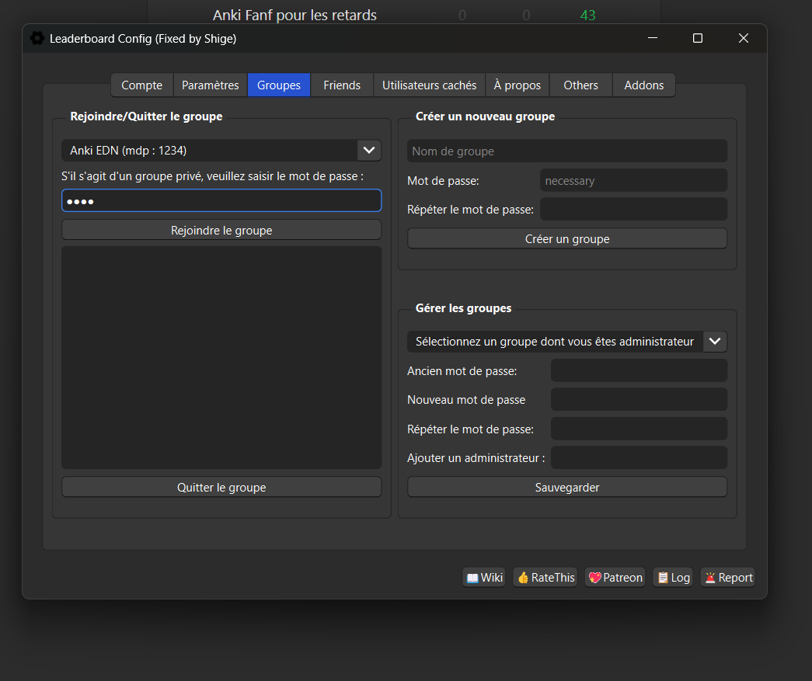
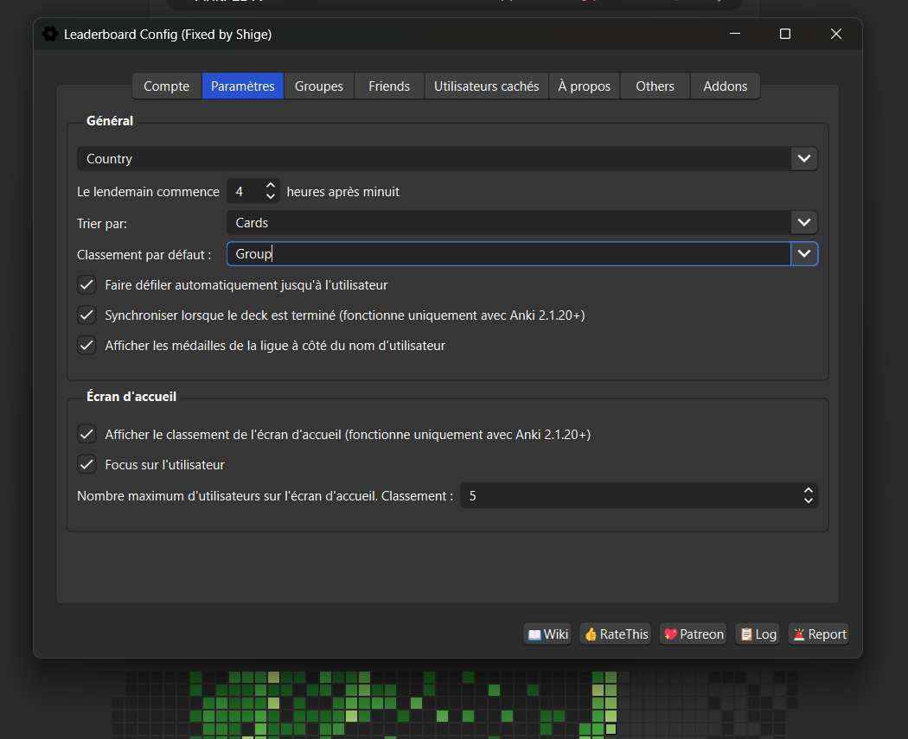
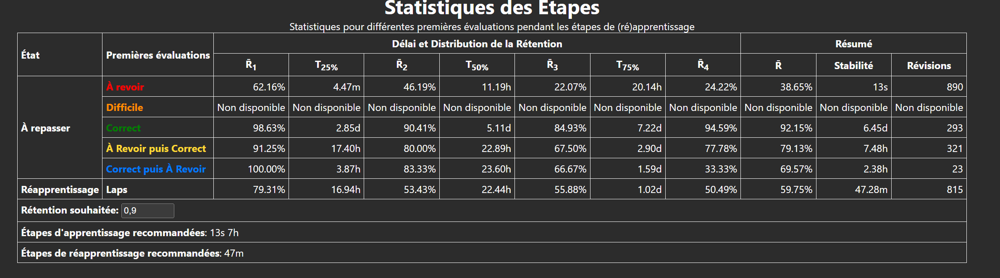
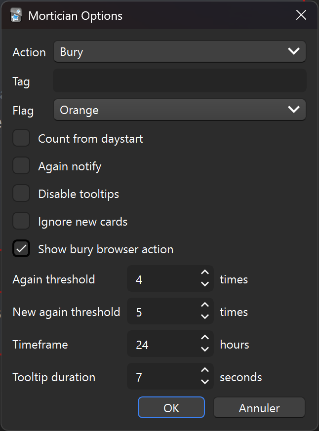

# Bonus
## Voici les outils que notre équipe vous recommande
### Add‑ons Anki 
Pour savoir comment installer un add-on, référez-vous au [tuto d'installation](./installation.md).

<h4>
  Pour les externes compétitifs : <a href="https://ankiweb.net/shared/info/175794613">Anki leaderboard</a> 
  <code>175794613</code>Copié ✅
   
</h4>

- C'est un classement des utilisateurs du deck, pour se motiver mutuellement.
- Sans `Leaderboard > Configuration` ou <kbd>Alt</kbd>+<kbd>C</kbd> ;
- Créez votre compte (onglet `Account`) ;
- **Rejoindre le groupe :**
    - Allez dans l'onglet `Groups` ;
    *   Cherchez et rejoignez le groupe **Anki EDN**. 
    <figure style="width: 500px;">
        
    </figure>
- **Afficher le groupe :**
    - Allez dans l'onglet `Config` ;
    - Dans le menu déroulant "Leaderboard", sélectionnez group pour qu'il s'affiche par défaut à l'ouverture du classement.
    <figure style="width: 500px;">
        
    </figure>
#### Pour optimiser ses réglages : [FSRS helper](https://ankiweb.net/shared/info/759844606) et [Search Stats Extended](https://ankiweb.net/shared/info/1613056169)     <code>759844606 1613056169</code> Copié ✅

- Addons extrêmement complets, dont nous vous invitons à lire la documentation pour voir ce qu'ils proposent. Ici nous vous expliquerons juste comment optimiser les intervalles de mémoire courte. 
- Après avoir utilisé le deck pendant au moins quelques jours  
    - Faites le raccourci <kbd class="kbd-keyboard">Shift</kbd> + <kbd class="kbd-keyboard">T</kbd> ;
    - Descendez jusqu'à ce tableau et entrez votre rétention souhaitée ; il générera les étapes recommandées que vous modifierez dans vos options.
    <figure>
    
    </figure>
<h4>
  <a href="https://ankiweb.net/shared/info/724035414">AJT Mortician</a> 
  <code>724035414</code>Copié ✅
   
</h4>

- Enterre automatiquement les cartes difficiles pour les revoir le lendemain. Configuration : `AJT > Mortician Options` ou <kbd>Alt</kbd>+<kbd>C</kbd>.
<figure style="width: 400px;">
    
</figure>

#### [Review Heatmap](https://ankiweb.net/shared/info/1771074083)     <code>1771074083</code>    Copié ✅

- Affiche votre assiduité sous forme de calendrier (et permet de voir votre programme).

#### [Card Info During Review](https://ankiweb.net/shared/info/2179286493)     <code>2179286493</code>    Copié ✅

- Affiche les statistiques de la carte en temps réel pendant les révisions.

#### [Customize Keyboard Shortcuts](https://ankiweb.net/shared/info/24411424)     <code>24411424</code>    Copié ✅

- Pour modifier tous les raccourcis clavier d'Anki.

#### [See Previous Card Ratings](https://ankiweb.net/shared/info/1906641654)     <code>1906641654</code>    Copié ✅

- Affiche votre résultat lors de la précédente révision de la carte.

#### [Hierarchical Tags / Colorful Tags](https://ankiweb.net/shared/info/594329289)     <code>594329289</code>    Copié ✅

- Organise et colorise vos tags de manière hiérarchique. Permet de voir les cartes suspendues en mode note.

#### [Opening the same window multiple time](https://ankiweb.net/shared/info/354407385)     <code>354407385</code>    Copié ✅
- Permet d'ouvrir plusieurs fois l'explorateur.

#### [Pass/Fail](https://ankiweb.net/shared/info/876946123)     <code>876946123</code>    Copié ✅

- Simplifie l'interface de révision en ne gardant que deux boutons (Échec / Réussite), ce qui permet de réviser plus rapidement tout en restant parfaitement compatible avec l'algorithme FSRS.

<h4>
  Pour garder le rythme : <a href="https://ankiweb.net/shared/info/1010827105">Auto Reveal</a> 
  <code>1010827105</code>Copié ✅
   
</h4>
Cet add‑on permet de ne pas "zone out" sur une carte.
- Gain de temps :
    
        <code>Basique-EDN-Picat-8b691 (AnkiCollab)</code>
        Copié ✅
    
    <figure style="width: 500px;">
        
    </figure>

### IA basées sur les référentiels
- [EDN GTP](https://chatgpt.com/g/g-nw9p7oAPP-edn-gpt)
- [EDN AI](https://chatgpt.com/g/g-XMpoZ4ivr-edn-ai)
- [DP EDN](https://chatgpt.com/g/g-sxGvTtmZ0-dossiers-progressifs-pour-l-edn)

 L'offre 1 an de Gemini pour les étudiants + [NotebookLM](https://notebooklm.google.com/) est très pratique aussi

### Ressources partagées par des externes 

- Collèges et fiches officielles
  - [Guide EFR / gaz du sang](https://www.google.com/search?q=Coll%C3%A8ge+des+enseignants+de+pneumologie+EFR+gaz+du+sang)
  - [Les 172 questions tombables Pneumo](https://cep.splf.fr/wp-content/uploads/2023/07/172-QUESTIONS-DE-PNEUMOLOGIE-TOMBABLES-A-L-EDN.pdf)
  - [Sémio Pneumo](https://semiologiepneumologique.com/)
  - [Radiologie — « Les images à connaître pour l'EDN »](https://cerf.radiologie.fr/sites/cerf.radiologie.fr/files/medias/Images%20%C3%A0%20conna%C3%AEtre%20pour%20EDN_2.pdf) 
  - [Collège de réanimation — vidéos](https://www.ce-mir.fr/cemir-learning)
  - [HAS EDN](https://www.has-sante.fr/jcms/p_3076609/fr/edn) 
  - [Sémio Neuro](https://www.cen-neurologie.fr/premier-cycle/semiologie-analytique/syndrome-myogene-myopathique)
  - [CNET](https://therap.fr/dossiers_progressifs/)
  - [UNESS cardio (ECG+++)](https://cardiologie.uness.fr/portail/index.php?title=Sp%C3%A9cial:Connexion&returnto=Sp%C3%A9cial%3AListe+des+Quiz&returntoquery=emdl_id%3D523)

- Chaînes YouTube & vidéos utiles
  - [Damien Legallois — cardiologie](https://www.youtube.com/results?search_query=Damien+Legallois)
  - [Dr Synapse — physiopathologie](https://www.youtube.com/results?search_query=Dr+Synapse)
  - [Docn'roll — néphrologie](https://www.youtube.com/results?search_query=Docn%27roll+nephrologie)
  - [Dermato‑ist](https://www.youtube.com/results?search_query=Dermato-ist)
  - [Linexplain — rappels thérapeutiques](https://www.youtube.com/results?search_query=Linexplain)
  - [Docteur Par Coeur — Bactéries / Antibio](https://www.youtube.com/watch?v=LJ1jJbRaTcg&list=PLz3OcroAK7ew7wc5670lHEN3W-aSXVUg-)
  - [Docteur astuce — mémotechniques](https://www.youtube.com/@DrAstuce/playlists)

- Images cliniques et entraînement
  - [Radiopaedia — cas cliniques](https://radiopaedia.org/search?lang=us&scope=mcqs)
  - [Pinky Bone — ressources orthopédie / semio](https://www.pinkybone.com/)

- LCA / Conférences
  - [LCA One — QCM et cours (payant)](https://www.google.com/search?q=LCA+One)
  - [LCA Professeur GEEK](https://www.youtube.com/c/PrGeek)
  - [TACFA — Conférences](https://tacfa.odoo.com/conf)

- Podcasts 
  - Nephrodio 

