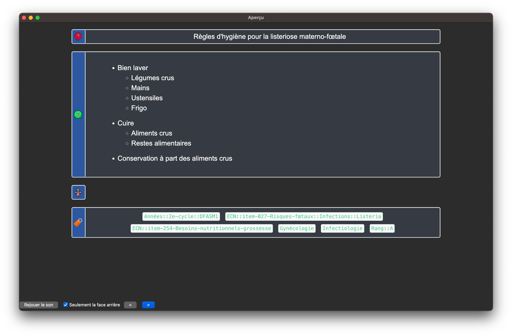
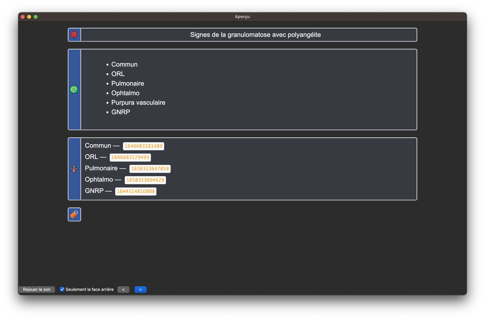
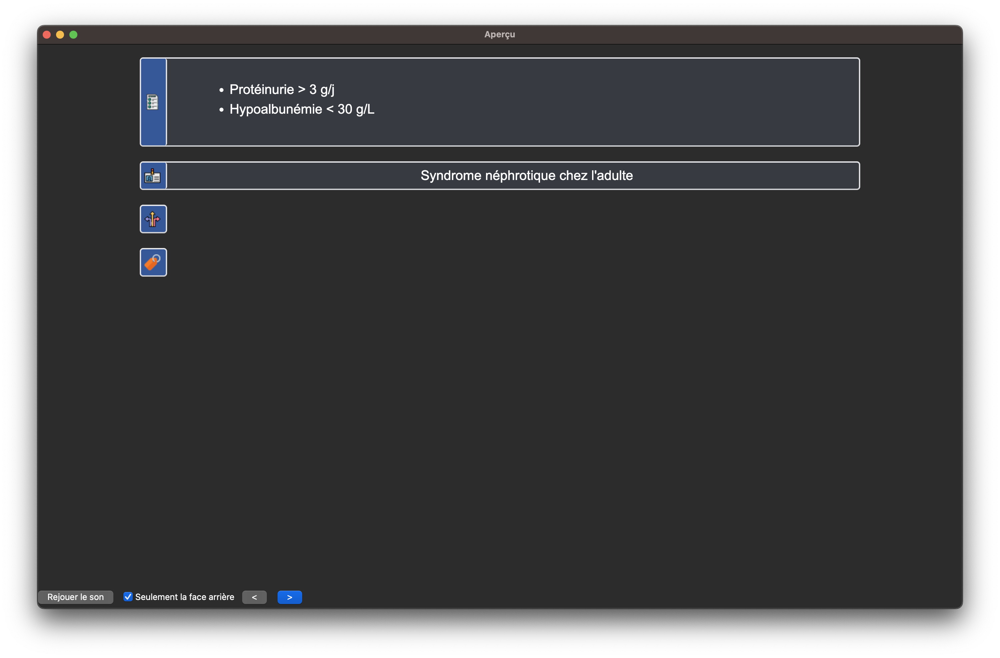
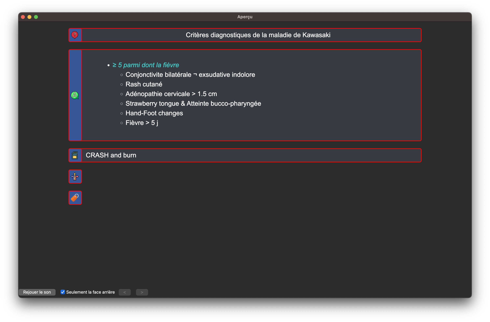
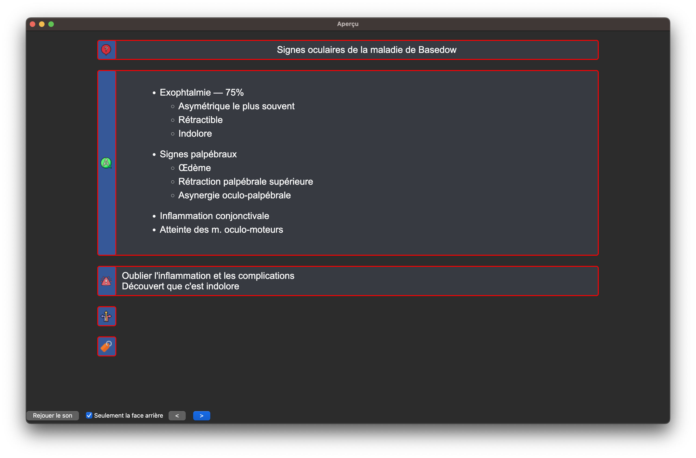

# Anki EDN
Anki EDN est un projet qui se base sur le travail et la méthodologie de [Léo Picat](https://picat.fr) (interne en MAR à Paris depuis 2024). Nous voulons rendre son paquet de flashcards collaboratif et communautaire pour le faire perdurer. *L'installation particulière sera expliquée au fil de ce tuto*.

✅ Il faut compter **15 minutes** de lecture avant de pouvoir utiliser les cartes Anki de ce **paquet (presque) exhaustif** qui vous mèneront aux EDN. 

<button class="carousel-btn carousel-prev">❮</button>
<figure class="carousel-slide active">

<figcaption>⚠️ Il faut lire et comprendre les items avant de les apprendre</figcaption>
</figure>
<figure class="carousel-slide">

<figcaption>Granulomatose avec polyangéite : une carte sommaire et des cartes liées.</figcaption>
</figure>
<figure class="carousel-slide">

<figcaption>Type de note Syndrome pour s'entraîner à la reconnaissance de pattern.</figcaption>
</figure>
<figure class="carousel-slide">

<figcaption>Des mnÉmoniques pour aider à la rétention.</figcaption>
</figure>
<figure class="carousel-slide">

<figcaption>Les cartes difficiles sont mises en évidence.</figcaption>
</figure>
<button class="carousel-btn carousel-next">❯</button>

📱 Pour travailler sur tablette ou téléphone, utilisez les applications **AnkiDroid** / **AnkiMobile** ou **AnkiWeb**. 
> Le support le plus complet reste Anki sur ordinateur, peu importe le système d'exploitation.

Ce paquet se distingue par la brièveté des cartes et par un système de mise en contexte des cartes. Tout cela rend favorable la rétention des informations à très long terme. 

>P.S. Les vidéos sont en cours de montage !
## Les liens
- [Notre Discord](https://discord.gg/2A7zHAEBYt)
- [La communauté des externes utilisant Anki](https://www.facebook.com/groups/anki.ecni), avec qui vous pouvez partager et poser des questions techniques.
- La [doc de Léo Picat](https://picat.fr/2024/06/02/paquet-anki-edn.html)  
- La [doc d'AnkiCollab](https://github.com/CravingCrates/AnkiCollab-Plugin/tree/main).
> Tournez la page pour commencer l'installation !
### Je n'ai jamais utilisé Anki
- Jetez un coup d'œil à [ce document](https://drive.google.com/file/d/1UWSg3gj3PyIJq0oXetesZVlbJuRGxLrA/view?usp=drive_link).
- Ensuite [ce drive vous sera utile](https://drive.google.com/drive/u/0/folders/1M9hg4EMRoFRQ4wh_E2xIOu_bKmg7ze59).
> Pour tout bug sur ce site, contactez informatique@c2su.org