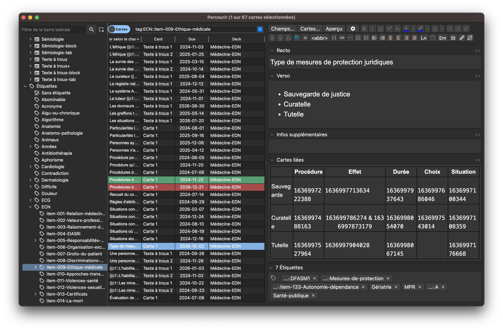

# Découverte

Une fois que vous avez installé le paquet, il y a 2 choses à faire en priorité :

1. Jetez un œil à quelques items pour voir si le paquet peut vous convenir :
   - Depuis la page d'acceuil d'Anki, allez dans l'explorateur de cartes (cliquez sur `Parcourir` ou appuyez sur <kbd class="kbd-keyboard">B</kbd>), puis rendez-vous dans le volet de navigation (à gauche de la page), descendez jusqu'à `Étiquettes` et sous <code>EDN</code> déroulez les étiquettes par items pour juger notre forme de rédaction ([Expliquée ici](./regles_du_deck.md)). Vous pouvez utiliser `Aperçu` (en haut à  droite), pour visualiser les cartes. 

<figure>
    
</figure>

2. **Exclure toutes les cartes des révisions (on reviendra là dessus):**       
    - Assurez-vous que l'explorateur est en mode Cartes et pas en mode Notes (en haut et à gauche de la barre de recherche) ;
   - dans le même volet de navigation (à gauche de l'explorateur), dans `Étiquettes` cliquez sur <code>EDN</code> ;
    - Sélectionnez toutes les cartes via <kbd>Ctrl</kbd>+<kbd>A</kbd> ou <kbd>Cmd</kbd>+<kbd>A</kbd> ;
    - suspendez les cartes via <kbd>Ctrl</kbd>+<kbd>J</kbd> ou
    <kbd>Cmd</kbd>+<kbd>J</kbd> ou via un click droit > <code>Suspendre/Reprendre</code>.
