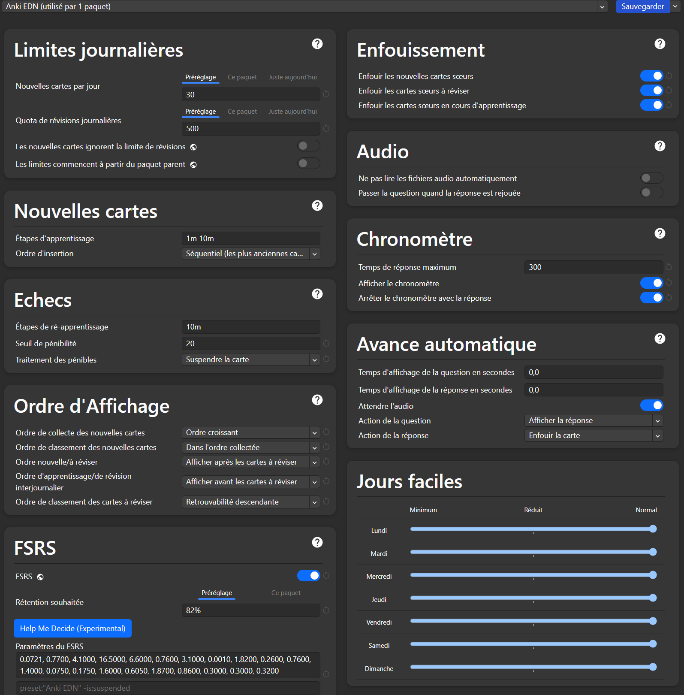

# Première installation : Anki, AnkiCollab (téléchargement du deck) et add‑ons
Ces trois étapes sont nécessaires au fonctionnement du paquet.
> **Utilisez un ordinateur** 💻📵

<h2>
  1. Anki
   
</h2>

- [Créez un compte AnkiWeb](https://ankiweb.net/account/signup);
- Acceptez "Terms and Conditions" et vérifiez votre mail.
- [Installez Anki sur votre ordinateur](https://apps.ankiweb.net/#downloads) ;
- Une fois sur l'application, appuyez sur synchronisation ou sur la touche <kbd>Y</kbd> puis connectez‑vous à votre compte AnkiWeb ;
- Allez dans `Outil > Greffons > Acquérir des greffons` ou <kbd>Ctrl</kbd>+<kbd>Maj</kbd>+<kbd>A</kbd> et collez 

  <code>1957538407 501542723 1052724801 1170639320 1906641654 2040501954</code>
   Copié ✅
. On a installé ça[^1].

<h2>
  2. AnkiCollab et téléchargement du deck
   
</h2>

- [Créez un compte AnkiCollab](https://www.ankicollab.com/signup);
- Relancez Anki, allez dans `AnkiCollab > Login` puis `AnkiCollab > Edit Subscriptions` et collez 
  <code>mango-may-georgia-eleven-moon-orange</code>
  Copié ✅
.
- Toujours dans `AnkiCollab > Edit Subscriptions`, allez dans `🛠️ Global Settings` et activez `Check for Updates on Startup` et `Automatically suspend new Cards` ;
- Vous avez téléchargé le deck Anki EDN !

<h2>
  3. Les options de révision 
   
</h2>

Nous les optimisons de façon à ce que l'utilisation du paquet ne soit pas trop chronophage. 
- Sur la page d'accueil, rendez‑vous à droite du paquet dans `⚙️ > options` ;
- En haut, à droite de Sauvegarder cliquez sur `Ajouter un préréglage` et entrez un nom.

### Les paramètres recommandés :
> Astuce : toutes les modifications effectuées sont matérialisées par le signe 🔄

<figure>
    <figcaption>⚠️ Il faut faire comme sur cette image</figcaption>
    
</figure>

- Nombre maximum de nouvelles cartes par jour : 50 (c'est bien le maximum, il vaut mieux s'arrêter autour de 25–40 [^30-40]) ;
- Aucune limite sur le nombre de révisions quotidiennes ;
- On préfère laisser les étapes d'origine. Pour optimiser ces réglages à votre mémoire, [lisez cette page](./Bonus.md) ;
- L'ordre d'affichage est réglé pour maximiser l'attention et gagner du temps ;
- Seuil de pénibilité à 20 (les cartes échouées plus de 19 fois sont suspendues et retournent ainsi dans la réserve des cartes) ;
- Le taux de rétention du FSRS est calculé pour un apprentissage sur plusieurs années. Il est plutôt bas afin de ne pas rendre les révisions trop chronophages. Il conviendra de l'augmenter à partir de l'été D3 (et non pas pour les partiels, où vous privilégierez les QCM et les DP). Les `Paramètres du FSRS` s'adaptent automatiquement, pas besoin d'y toucher ;
- Les "Cartes sœurs" n'apparaissent pas le même jour pour favoriser la mémoire à long terme ;
- Le reste des réglages est identique à ceux par défaut. 

> Lors de la première révision, les espacements entre les révisions sont très grands et peuvent surprendre. Dès votre 3e jour de révisions, dans `FSRS` cliquez sur `Optimiser`. Répétez l'opération toutes les 2 semaines puis tous les mois ! (Créez un rappel)  
Pour en savoir plus sur les paramètres, [référez‑vous à cette vidéo](https://www.youtube.com/watch?v=uo-qQvOZDfg).

# Découverte

Une fois que vous avez installé le paquet, il y a 2 choses à faire en priorité :

1. Jetez un œil à quelques items pour voir si le paquet peut vous convenir :
   - Depuis la page d'accueil d'Anki, allez dans l'explorateur de cartes (cliquez sur Parcourir ou appuyez sur <kbd class="kbd-keyboard">B</kbd>), puis rendez‑vous dans le volet de navigation (à gauche de la page), descendez jusqu'à `Étiquettes` et sous <code>EDN</code> déroulez les étiquettes par items pour juger notre forme de rédaction ([Expliquée ici](./regles_du_deck.md)). Vous pouvez utiliser `Aperçu` (en haut à droite) pour visualiser les cartes.  

<figure>
    
</figure>

2. **Exclure toutes les cartes des révisions (on reviendra là‑dessus)**         
    - Assurez‑vous que l'explorateur est en mode Cartes et pas en mode Notes (en haut et à gauche de la barre de recherche) ;
    - Dans le même volet de navigation (à gauche de l'explorateur), dans `Étiquettes` cliquez sur <code>EDN</code> ;
    - Sélectionnez toutes les cartes via <kbd>Ctrl</kbd>+<kbd>A</kbd> ou <kbd>Cmd</kbd>+<kbd>A</kbd> ;
    - Suspendez les cartes via <kbd>Ctrl</kbd>+<kbd>J</kbd> ou <kbd>Cmd</kbd>+<kbd>J</kbd> ou via un clic droit > <code>Suspendre/Reprendre</code>.

# Réviser un nouvel item

> Avant de commencer à réviser les fiches Anki, il faut avoir une bonne compréhension du cours.  
Sinon, vous serez déroutés par l'ordre aléatoire des cartes.

1. Rendez‑vous dans l'explorateur où vous irez chercher l'étiquette de l'item que vous voulez réviser   
    - Allez dans l'explorateur de cartes (cliquez sur Parcourir ou appuyez sur <kbd class="kbd-keyboard">B</kbd>), puis rendez‑vous dans le volet de navigation (à gauche), descendez jusqu'à `Étiquettes` et sous <code>EDN</code> déroulez les items puis cliquez sur celui qui vous intéresse. Vous pouvez alors prendre connaissance des cartes déjà créées avec `Aperçu` (en haut à droite). 
    
2. Désuspendre les cartes que vous souhaitez apprendre   
    - Sélectionnez les cartes qui vous intéressent puis <kbd>Ctrl</kbd>+<kbd>J</kbd> / <kbd>Cmd</kbd>+<kbd>J</kbd> ou via un clic droit > `Suspendre/Reprendre`.

[^1]: Les greffons installés : 
    - 1957538407 - [AnkiCollab](https://ankiweb.net/shared/info/1957538407) : Pour que AnkiCollab fonctionne !
    - 501542723 - [Auto Sync](https://ankiweb.net/shared/info/501542723) : Pour ne pas perdre votre progression.
    - 1052724801 - [BetterSearch](https://ankiweb.net/shared/info/1052724801) : Pour naviguer facilement entre les tags (très important).
    - 1170639320 - [Clickable note links](https://ankiweb.net/shared/info/1170639320) : Add‑on codé par Léo Picat inhérent au paquet.
    - 1906641654 - [See Previous Card Ratings in Reviewer](https://ankiweb.net/shared/info/1906641654) : Pour connaître la difficulté des cartes.
    - 2040501954 - [Symbols As You Type](https://ankiweb.net/shared/info/2040501954) : Pour éditer facilement les cartes.

[^30-40]: Comme la plupart des items ont autour de 50 cartes, on comprend vite que si l'on veut faire plus d'un item par jour, on ne peut pas tout désuspendre.