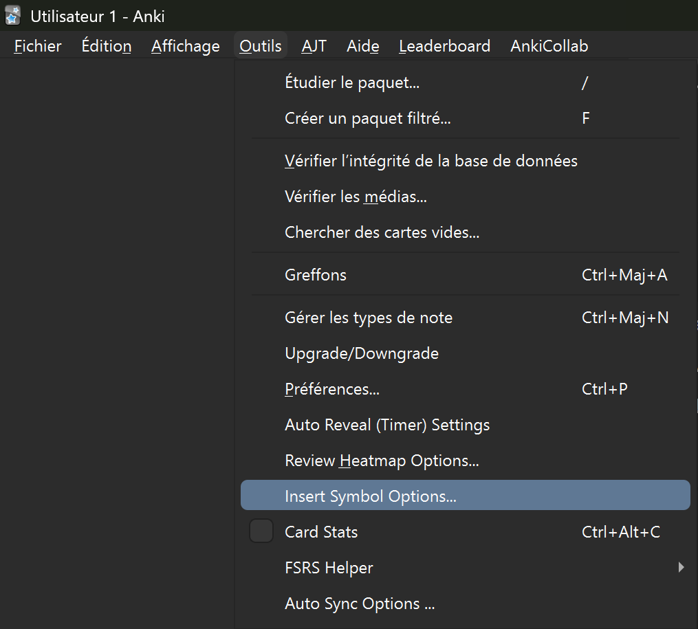
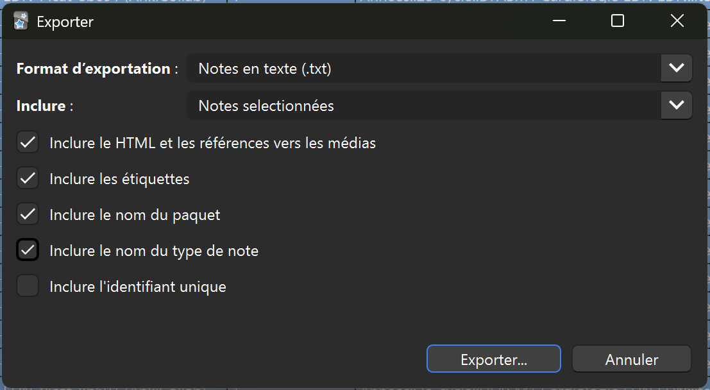
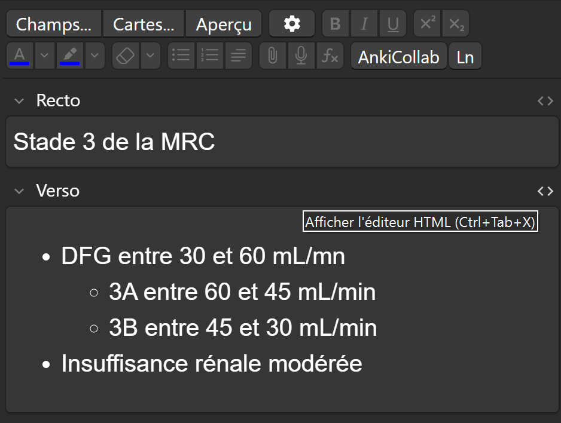

# Les mises à jour du paquet grâce à AnkiCollab
Ce paquet est collaboratif et nous avons besoin de vous pour l'actualiser.

> Les MAJ que vous recevrez sont susceptibles d'ajouter, de supprimer (rarement) ou de modifier des cartes que vous avez déjà apprises. Les modifications faisant partie du programme, vous serez à jour pour le concours.

- Des sauvegardes automatiques sont réalisées nativement par Anki [ici](https://docs.ankiweb.net/files.html#file-locations).
- Si vous voulez protéger des cartes des futures mises à jour qu'elles pourraient subir :
    - Utilisez (pour chaque carte concernée) le tag `Ankicollab_protect::all`.
    - Si vous souhaitez protéger un seul champ, utilisez par exemple `Ankicollab_protect::verso`.

## Notifications

> Après chaque MAJ, des notifications à l'ouverture d'Anki et sur Discord apparaîtront.

### Après une mise à jour
- Des tags sont généralement créés pour que vous repériez les cartes mises à jour.
- Si la MAJ concerne un item que vous révisez, nous vous conseillons **d'oublier les cartes modifiées que vous aviez apprises**, puis de les réapprendre 
    - Allez dans l'explorateur de cartes (cliquez sur Parcourir ou appuyez sur <kbd class="kbd-keyboard">B</kbd>), puis rendez-vous dans la barre de recherche en haut et au milieu. Tapez <code>tag:</code>. Une autre barre de recherche s'ouvre.
    - Dans cette nouvelle barre de recherche, tapez <code>MAJ</code>.
    - Sélectionnez les cartes qui vous intéressent, puis appuyez sur <kbd>Ctrl</kbd>+<kbd>Alt</kbd>+<kbd>N</kbd> | <kbd>Cmd</kbd>+<kbd>Alt</kbd>+<kbd>N</kbd> ou utilisez le clic droit > `Oublier...`.
    - Si elles ne sont pas suspendues, ces dernières entrent dans la file des "nouvelles cartes".
- Vous pouvez aussi trouver les cartes modifiées ou ajoutées selon la date grâce à l'add‑on BetterSearch.
    - Allez dans Parcourir (<kbd class="kbd-keyboard">B</kbd>), puis dans <code>BetterSearch &gt; Show Date Range Dialog for Edited | Added</code> et lancez la recherche.

### Après un ajout
- [Les nouvelles cartes sont automatiquement suspendues ;](./installation.md#ankicollab)
- Les notifications décrivent quels items ont reçu des nouveautés :
    - À vous de désuspendre les cartes 
    - Allez dans l'explorateur de cartes (cliquez sur Parcourir ou appuyez sur <kbd class="kbd-keyboard">B</kbd>), puis rendez-vous dans la barre de recherche en haut et au milieu. Tapez <code>tag:</code>. Une autre barre de recherche s'ouvre.
    - Dans cette nouvelle barre de recherche, tapez <code>NEW</code>.
    - Sélectionnez les cartes qui vous intéressent, puis appuyez sur <kbd>Ctrl</kbd>+<kbd>J</kbd> / <kbd>Cmd</kbd>+<kbd>J</kbd> ou utilisez le clic droit > `Suspendre/Reprendre`.

## Rédiger
Vous pouvez soumettre des modifications pour de multiples raisons, même pour des questions d'ergonomie, de grammaire ou d'esthétique. N'hésitez pas à venir discuter sur le Discord.

> Nous acceptons uniquement les modifications qui tiennent compte des [normes](./regles_du_deck.md) et des [abréviations](./symboles.md) du paquet.

> Il faut maîtriser la forme rédactionnelle des cartes.

> Il faut maîtriser l'utilisation de [l'add‑on des liens entre les cartes](https://ankiweb.net/shared/info/1170639320) ; vous trouverez un tuto ci‑dessous.

### Pour rédiger proprement
- Vérifiez que la carte que vous voulez rajouter n'existe pas déjà sous un autre tag.
- Lisez les [normes du deck](./regles_du_deck.md).
- Respectez l'utilisation des tags :
    - Entrez le(s) item(s) de la carte `EDN::item-*numéro*-*intitulé*`, parfois aussi les sous-tags.
    - Entrez la/les situation(s) de départ de la carte `EDN::ssd-*numéro*-*intitulé*`, parfois aussi les sous-tags.
    - Entrez les tags des matières.
    - Évitez de mélanger les `Rang::A` et les `Rang::B` (le champ `Infos supplémentaires` est votre ami).
    - Entrez les potentiels tags accessoires `Antibiothérapie`, `Score`, ...

- Utilisez les [abréviations](./symboles.md) du deck.
    - Pour obtenir les icônes dans votre éditeur :
        - <a href="./assets/raccourcis.csv" download>Télécharger ce fichier</a>
        - Allez dans `Outils > Insert Symbol Options...`
        <figure style="width: 400px;">
         
        </figure>
        - Cliquez sur `Import` et sélectionnez le fichier téléchargé puis `Ok`.
    - Il suffit maintenant d'écrire les commandes directement dans le corps de votre texte pour qu'elles s'insèrent.
    - Les commandes sont visualisables sur [ce tableau](./symboles.md).

<ul style="list-style-type: disc "><li><ul style="list-style-type: circle;"><li><ul style="list-style-type: square;"> <li> </li></li></ul></li></ul></ul>

- Pour écrire les puces ci‑dessus, utilisez <kbd>Ctrl</kbd>+<kbd>Maj</kbd>+<kbd>.</kbd> | <kbd>Cmd</kbd>+<kbd>Maj</kbd>+<kbd>.</kbd>

### Pour mettre à jour efficacement un item à l'aide de l'IA
- Nous vous conseillons d'utiliser [Claude](https://claude.ai).
- Allez dans Parcourir (<kbd class="kbd-keyboard">B</kbd>), cherchez les cartes d'intérêt avec <code>tag:</code>, sélectionnez-les avec <kbd>Ctrl</kbd>+<kbd>A</kbd> | <kbd>Cmd</kbd>+<kbd>A</kbd> et exportez-les avec <kbd>Ctrl</kbd>+<kbd>Maj</kbd>+<kbd>E</kbd> | <kbd>Cmd</kbd>+<kbd>Maj</kbd>+<kbd>E</kbd> ou via le menu `Exporter les notes...`.
    - Exportez selon ces réglages.
    <figure style="width: 350px;">
    
    </figure>
- Isolez dans un PDF l'item d'intérêt (des collègues sont disponibles sur le Discord).
- Avec ces deux pièces jointes, envoyez ce prompt à l'IA :

  <code>Voici mes fiches Anki et le référentiel officiel pour un item.
Tu utiliseras uniquement le contenu du PDF comme source.
Objectif :
Vérifie chaque carte Anki et indique si elle est exacte, à modifier, non sourcée, redondante ou à supprimer.
Prends garde aux tags et aux rangs des informations.
Si des notions du référentiel ne sont pas fichées, crée de nouvelles cartes dans mon style habituel.
Classe le travail par sections du référentiel (tableau synthèse + analyse détaillée). N’analyse en détail que les cartes modifiées, supprimées ou ajoutées. Utilise le format HTML de mes cartes, la concision et la densité EDN.
Format attendu :
1. Tableau synthèse section par section
2. Analyse détaillée des cartes modifiées/ajoutées
3. Proposition de nouvelles cartes au format Anki (HTML lisible, pas d’export brut) avec leurs tags appropriés
4. Signalement des cartes redondantes, sans correspondance ou hors référentiel</code>
  Copié ✅

- Faites les modifications à l'aide des entrées HTML des cartes `<>` (<kbd>Cmd</kbd>+<kbd>Tab</kbd>+<kbd>X</kbd> | <kbd>Ctrl</kbd>+<kbd>Tab</kbd>+<kbd>X</kbd>)
<figure style="width: 350px;">
    
</figure>

### Pour créer des liens entre les cartes 
- Récupérez le NID de la note à lier.
    - Sélectionnez la note via l'explorateur.
    - <kbd>Cmd</kbd>+<kbd>Maj</kbd>+<kbd>C</kbd> | <kbd>Ctrl</kbd>+<kbd>Maj</kbd>+<kbd>C</kbd> ou clic droit > Informations et cherchez l'identifiant de **note** (pas de carte).
- Modifiez la note dans laquelle vous souhaitez insérer le lien.
    - Collez le NID à l'endroit souhaité.
    - Sélectionnez le NID et appuyez sur <kbd>Cmd</kbd>+<kbd>Alt</kbd>+<kbd>L</kbd> | <kbd>Ctrl</kbd>+<kbd>Alt</kbd>+<kbd>L</kbd> ou appuyez sur Entrée.

Lorsque vous consulterez la note, si vous cliquez sur le NID, le navigateur s'ouvrira sur la note que vous avez liée.

## Soumettre

> Que vos ajouts, suppressions ou modifications soient acceptés par la communauté ou non, cela n'impactera pas votre paquet. Vous conserverez vos modifications.

### Soumettre des nouvelles cartes
- Écrivez vos nouvelles cartes dans le menu principal Ajouter.
- Dans `Type` sélectionnez le [format qui convient](./regles_du_deck.#types-de-notes) suivi de `-EDN-Picat-x`.
- Dans `Paquet` sélectionnez `Anki EDN`.
- Remplissez les champs.

#### S'il s'agit d'une seule carte 
- Toujours dans l'onglet d'édition de la note, sélectionnez `AnkiCollab` > `New card` et laissez un message explicatif contenant l'item en question.

#### S'il s'agit d'un groupe de cartes 
- Dans l'explorateur, sélectionnez les notes que vous voulez proposer, puis clic droit > `AnkiCollab: Bulk suggest notes` > `New Card` et laissez un message explicatif contenant l'item en question.

### Proposer des modifications
- Modifiez les champs des notes d'intérêt.

#### S'il s'agit d'une seule carte
- Toujours dans l'onglet d'édition de la note, sélectionnez `AnkiCollab` > `Updated content` (ou autre) et laissez un message explicatif.

#### S'il s'agit d'un groupe de cartes
- Dans l'explorateur, sélectionnez les notes que vous voulez proposer, puis clic droit > `AnkiCollab: Bulk suggest notes` > `Bulk Suggestion` (ou autre) et laissez un message explicatif.

### Supprimer des cartes 
On peut vouloir supprimer des cartes parce qu'elles ne sont plus utiles, trop anecdotiques, ou inadaptées.
- Dans l'explorateur, sélectionnez les notes que vous voulez proposer, puis clic droit > `AnkiCollab: Request note removal` > `Note Removal` (ou autre) et motivez la raison.
