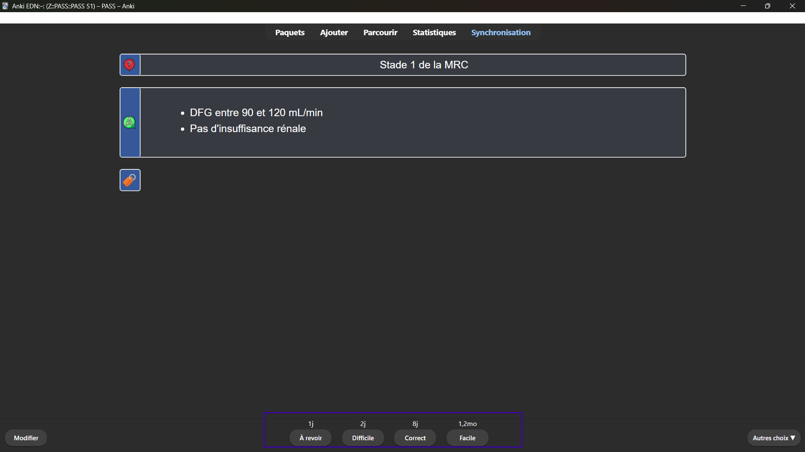

# Organisation des cartes
## Les étiquettes 🏷️

Les cartes sont classées via des étiquettes :

- des étiquettes par items, parfois avec des sous‑tags ;
- des étiquettes par matière ;
- des étiquettes par rang ;
- et un certain nombre d'étiquettes pour faciliter les recherches (`Antibiothérapie`, `Formule`, `Norme`, `Seuil`, `Nom-propre`, entre autres).

<figure>
    
</figure>

## Les drapeaux 🏴
> C'est à vous de les placer afin d'optimiser vos révisions

Pour marquer vos cartes durant vos révisions, allez dans `Autres choix` > `Marqueur de carte` ou simplement <kbd>Ctrl</kbd>+<kbd>1</kbd>, <kbd>2</kbd>, <kbd>3</kbd> ou <kbd>4</kbd>.

Voici comment peuvent s'utiliser les drapeaux :

- Rouge pour les cartes qui doivent être modifiées ;
- Orange pour les cartes que vous considérez comme difficiles ;
- Vert pour les cartes importantes ;
- Bleu pour les cartes qui peuvent être améliorées (avec une illustration par exemple).

## Les paquets

**Il y a un seul paquet 2e cycle.**
Car :
- une carte peut être en rapport avec deux items ;
- une carte ne peut être que dans un paquet à la fois ;
- une carte peut avoir plusieurs étiquettes.

Nous **utilisons donc des étiquettes pour classer vos cartes** et le paquet sert uniquement à **rassembler les cartes à réviser**. Compte tenu des exigences de l'EDN, toutes les cartes sont à réviser de la même façon[^approximation-rang].

[^approximation-rang]: Le paquet, se voulant exhaustif, comprend à la fois des connaissances rentables à bien connaître et d'autres, plus anecdotiques. Vous pouvez exclure les cartes que vous jugez non rentables.

## Bien réviser
### Révisions des cartes
- **Difficile** : Usage exceptionnel (réponse juste après un long doute).
- **À revoir** : Si oubli partiel. Les intervalles sont gérés par l'algo, ne trichez pas ! Si une carte gêne, suspendez-la.
- **Facile** : Uniquement pour les évidences.

<figure>
    
</figure>

### Autres
- **FSRS** : Optimisez-le une fois par mois (`⚙️ > options > FSRS > Optimiser`).  
- Faites vos révisions journalières d'une traite si possible.