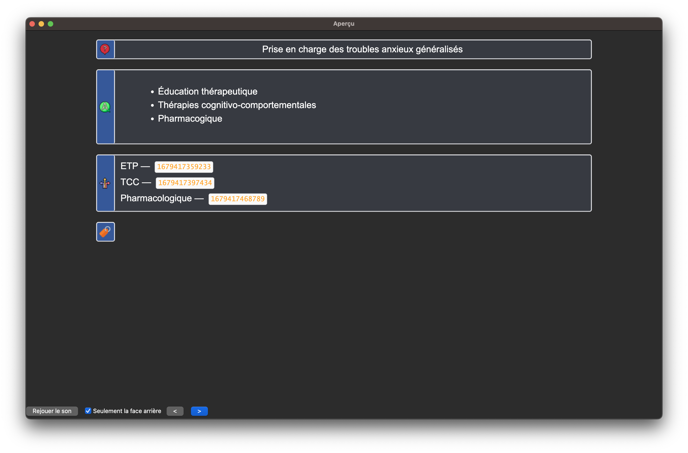
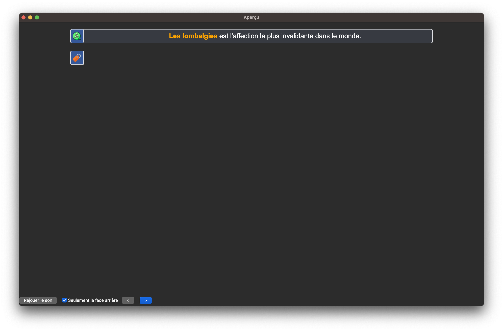

# Les normes du paquet
Ce chapitre explique le format des cartes utilisées et les modes de rédactions des différentes cartes. Pour participer à l'évolution de ce paquet, il faut respecter le mode rédactionnel et intégrer sa logique.

## Flashcards

Les cartes qui composent le paquet ne sont pas des fiches de cours, mais des flashcards.

> 1 carte = 1 info

Par exemple :
Si une prise en charge comprend un traitement pharmacologique, des règleshygiéno-diététiques, et des examens complémentaires de suivi, il y'aura  probablement  4 cartes : une par pan de la prise en charge et une carte "sommaire" qui demandera de réciter ces 3 grands axes. Des liens clicables entre les cartes sont construit, ce qui permet une meilleure mise en contexte. Lisez  [cette doc](https://ankiweb.net/shared/info/1170639320) pour bien l'utiliser.

<figure>
    
    <figcaption>Les cartes sommaires permettent de ne pas déstructurer l'apprentissage.</figcaption>
</figure>

Les cartes sont donc très courtes, ce qui a 2 conséquences :

- un nombre important de cartes ;
- des cartes rapides à répondre (rarement plus de 10s / cartes)

<figure>
    
    <figcaption>Ici on a une carte sommaire pour la granulomatose avec polyangéite. Les nombreux signes cliniques sont répartis en différentes catégories de telle sorte à ce que chacune des cartes de la série demande de réciter moins de 6-8 signes cliniques.</figcaption>
</figure>

### Standardisation

Les formulations des cartes sont standardisées : 

- "Examens complémentaires devant <i>X</i>" ;
- "Aspect de <i>X</i> à l'imagerie" ;
- "Prévalence de <i>X</i>" ;
- "Antibiothérapie de <i>X</i>" ;
- etc.

Cela permet de retrouver facilement les cartes dans l'explorateur une fois
que l'on a identifié les formulations récurrentes.

**Les données épidémiologiques sont toujours rapportées sur 100 000 habitant·e·s
de façon à être comparables**, sauf rares exceptions (données en lien avec les
cancers ou quand parler en 1 pour <i>n</i> a du sens). 
> Pour passer d'une valeur
absolue au rapport pour 100 000, il faut simplement multiplier par 660 (en comptant 66 millions d'habitants en France).

## Types de notes

Il y a 5 types de notes principaux :

- **Basique**, avec un Recto et un Verso qui crée une carte : Recto → Verso ;
- **Texte à trous**,
- **Sémiologie**, un champ Image (du signe), un champ Nom (du signe), et un
  champ Description (du signe). Cela crée 3 cartes : Image → Nom, Nom →
  Description et Description → Nom ;
- **Syndrome**, un champ Nom (du syndrome), et un champ Description (du
  syndrome). Cela crée 2 cartes : Nom → Description et Description → Nom.

<figure>
    
    <figcaption>Avec le type de note syndrome, on s'entraine à la fois à réciter <b>et</b> reconnaitre un ensemble de signes.</figcaption>
</figure>

## Champs
Certains champs sont auto-explicatifs. Focus sur :
- **Infos supplémentaires** : Illustrations ou infos majeures (bug d'affichage mobile possible).
- **Cartes Liées** : Voir [supra](#flashcards).
- **Mots clés** : Pour la recherche (ex: "SAPL" pour "Syndrome des anti phospholipides"). Parfois placés dans `Comments`.

### Affichage des cartes difficiles

Les cartes considérées comme difficiles apparaissent différemment pendant les révisions pour pouvoir les repérer et y lire la réponse avec plus d'attention.

<figure>
    
    <figcaption>Un liseré rouge permet d'identifier en un clin d'œil les cartes avec lesquels on a le plus de mal.</figcaption>
</figure>

Il y a 2 façons de marquer une carte comme difficile :

- en lui appliquant le drapeau orange ;
- en lui attribuant un tag `Difficile`.

### Autre

Il y a des fautes d'accord volontaire sur certaines cartes Texte à trous afin de
ne pas donner trop d'indices lors des révisions.

<figure>
    
    <figcaption>Si l'accord était respecté, on aurait un indice délétère sur la bonne réponse.</figcaption>
</figure>

### Droits d'auteur

Tout le contenu du paquet, ainsi que le paquet lui même sont disponibles sous la licence [Creative
Commons](https://creativecommons.org/).
Vous pouvez donc partager et modifier les cartes sous 3 conditions :

- vous devez citer Léo Picat et Anki EDN ;
- vous ne pouvez en faire un usage commercial ;
- vous devez les partager sous la même licence.
